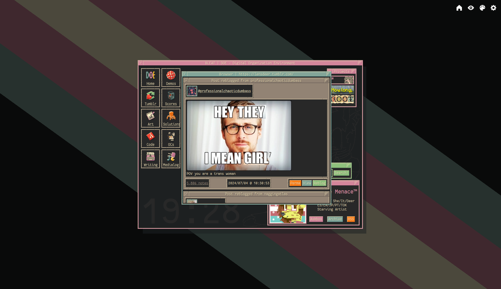

# doe-tumblr-theme

Version control repo for my [tumblr blog](https://lensdeer.tumblr.com)'s theme.

This theme is designed to match my [website](https://lensdeer.neocities.org)'s design, and is not intended to function without [its stylesheet](https://marshdeer.github.com/neocities/blob/deer/includes/globals/doe.css).

This repository is not useful for people other than me, and exists solely so that I can have a backup of the theme in case I ever need to roll it back. Use at your own risk.

The Javascript portion _heavily_ borrows from [cornetespoir/npf-theme-base](https://github.com/cornetespoir/npf-theme-base).

